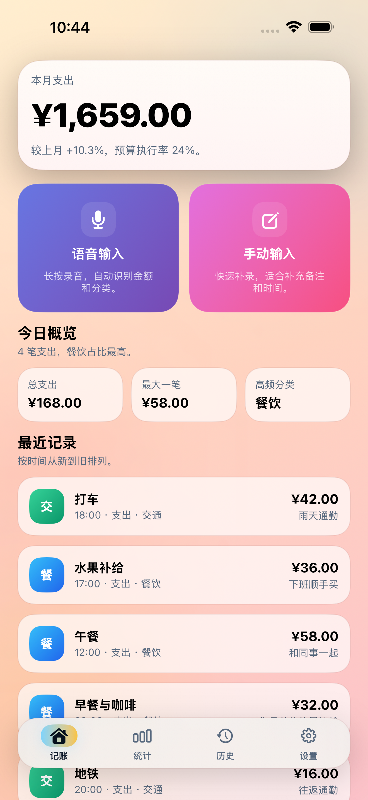
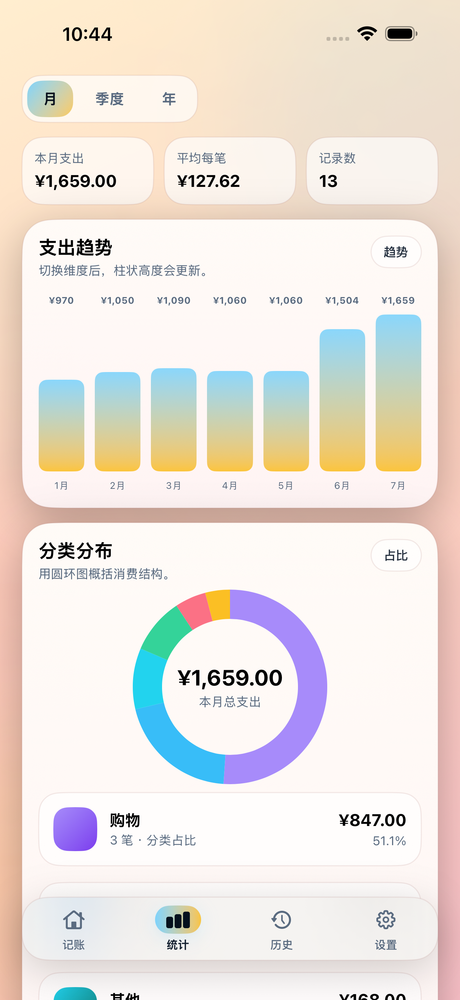
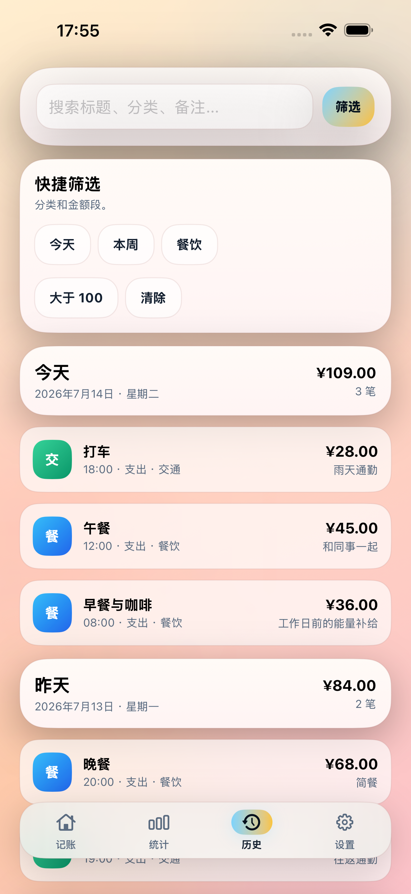
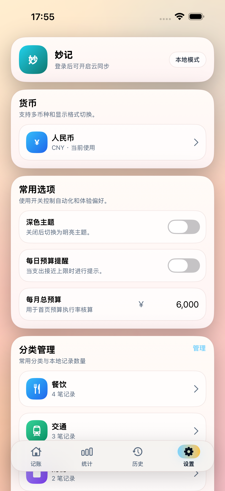
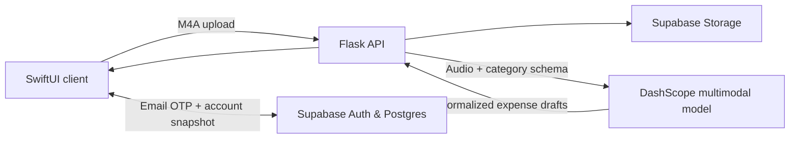

# MiaoJi · 妙记

A voice-first, local-first personal finance companion for iPhone and iPad.

[English](README.md) · [简体中文](README_zh.md)


MiaoJi turns natural Mandarin speech into structured expense entries, keeps the ledger available offline, and optionally synchronizes it across devices through Supabase. Its focused SwiftUI interface combines fast entry, budgets, category insights, search, CSV export, and light/dark appearance support.

> [!NOTE]
> MiaoJi is under active development. Review the privacy and deployment notes before using the voice pipeline with sensitive financial information.

## Preview


<table>
  <tr>
    <td align="center"></td>
    <td align="center"></td>
    <td align="center"></td>
    <td align="center"></td>
  </tr>
  <tr>
    <td align="center">Fast entry</td>
    <td align="center">Spending insights</td>
    <td align="center">Searchable history</td>
    <td align="center">Personal controls</td>
  </tr>
</table>

## Highlights

- **Voice-first capture** — record Mandarin expense descriptions and turn multiple purchases into categorized drafts.
- **Local-first ledger** — records, categories, budgets, currency preferences, and appearance settings remain usable offline.
- **Optional cloud sync** — email OTP authentication and row-level security keep each Supabase account snapshot isolated.
- **Useful analytics** — monthly, quarterly, and yearly trends, category distribution, budget progress, and concise conclusions.
- **Practical controls** — manual income/expense entry, editing, filters, multiple currencies, custom categories, and CSV export.
- **Native experience** — SwiftUI interface for iPhone and iPad with light and dark themes.

## Architecture




| Layer  | Technology                       | Responsibility                                                 |
| ------ | -------------------------------- | -------------------------------------------------------------- |
| Client | Swift 5, SwiftUI, AVFoundation   | Recording, ledger UI, local persistence, CSV export            |
| API    | Python, Flask                    | Audio validation, storage upload, AI response normalization    |
| Data   | Supabase Auth, Postgres, Storage | OTP authentication, RLS-protected snapshots, audio objects     |
| AI     | DashScope OpenAI-compatible API  | Mandarin audio understanding and structured expense extraction |


## Project layout

```text
.
├── client/      # SwiftUI application, unit tests, and UI tests
├── server/      # Flask voice-processing API and tests
├── supabase/    # Database migration and Supabase setup notes
└── docs/assets/ # Brand assets and product previews
```

## Getting started

### Requirements

- macOS with Xcode 16 or later
- iOS/iPadOS 18 or later
- Python 3.9 or later
- A Supabase project
- A DashScope API key for voice parsing

### 1. Clone the repository

```bash
git clone https://github.com/KapiYue/miaoji.git
cd miaoji
```

### 2. Configure Supabase

Run every SQL file in `[supabase/migrations](supabase/migrations)` in filename order using the Supabase SQL Editor. Then configure email OTP templates as described in `[supabase/README.md](supabase/README.md)`.

The voice pipeline uses a **private** Storage bucket named `user-audio`. The API creates short-lived signed URLs and deletes uploaded recordings after parsing; configure a 24-hour lifecycle cleanup as a fallback for interrupted requests.

### 3. Configure the iOS client

Update `[client/MiaoJiConfig.xcconfig](client/MiaoJiConfig.xcconfig)`:

```xcconfig
MIAOJI_API_BASE_URL = http:/$()/127.0.0.1:8000
SUPABASE_URL = https:/$()/YOUR_PROJECT.supabase.co
SUPABASE_PUBLISHABLE_KEY = YOUR_PUBLISHABLE_KEY
```

Never place a Supabase `service_role` key in the iOS application. Open `[client/MiaoJiAccout.xcodeproj](client/MiaoJiAccout.xcodeproj)` in Xcode, select the `MiaoJiAccout` scheme, and run it on a simulator or device.

### 4. Run the API

```bash
cd server
python3 -m venv venv
source venv/bin/activate
python -m pip install -r requirements.txt
cp .env.example .env
python -m flask --app app run --host 0.0.0.0 --port 8000
```

Fill in `server/.env` before starting the API. Server-side secrets must never be committed.

## Tests

Run the backend test suite:

```bash
python -m unittest server/test_app.py
```

Run the iOS tests from Xcode with **Product → Test**, or from the command line with an installed simulator:

```bash
xcodebuild test \
  -project client/MiaoJiAccout.xcodeproj \
  -scheme MiaoJiAccout \
  -destination 'platform=iOS Simulator,name=iPhone 16 Pro'
```

## Privacy and security

- Ledger data is stored locally and can optionally be synchronized to Supabase.
- Voice recordings are uploaded to the configured Supabase Storage bucket and sent to the configured DashScope model for parsing.
- The Flask API requires the Supabase `service_role` key; keep it exclusively on a trusted server.
- Review `[SECURITY.md](SECURITY.md)` for vulnerability reporting and `[supabase/README.md](supabase/README.md)` for RLS setup.
- Follow `[docs/app-store-release-checklist.md](docs/app-store-release-checklist.md)` before creating an App Store archive.

## Contributing

Contributions are welcome. Please read `[CONTRIBUTING.md](CONTRIBUTING.md)` and follow our `[CODE_OF_CONDUCT.md](CODE_OF_CONDUCT.md)` before opening an issue or pull request.

## License

MiaoJi is available under the [MIT License](LICENSE).

## Contact

- Repository: [github.com/KapiYue/miaoji](https://github.com/KapiYue/miaoji)
- Maintainer: [zdjoey@126.com](mailto:zdjoey@126.com)
