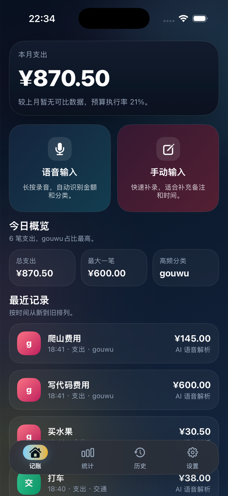
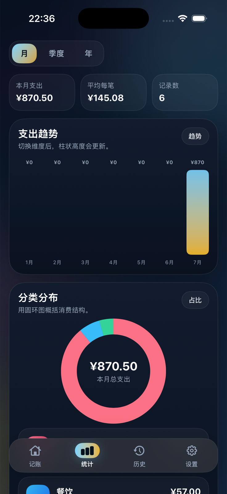
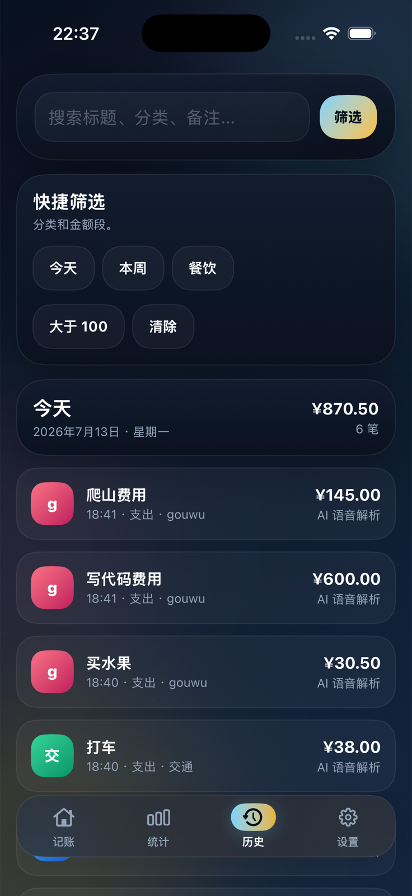
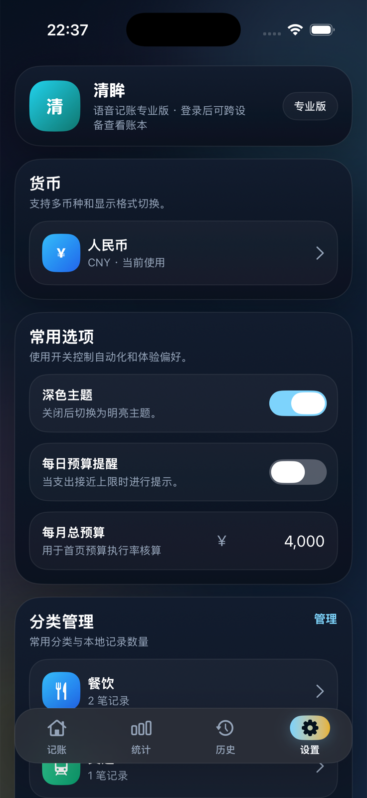
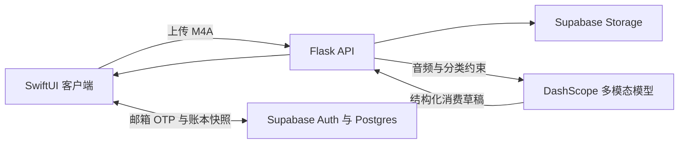

<p align="center">
  <picture>
    <source media="(prefers-color-scheme: dark)" srcset="docs/assets/miaoji-logo-dark.png">
    <source media="(prefers-color-scheme: light)" srcset="docs/assets/miaoji-logo-light.png">
    
  </picture>
</p>

<h1 align="center">MiaoJi · 妙记</h1>

<p align="center">
  一款语音优先、本地优先的 iPhone 与 iPad 个人记账应用。
</p>

<p align="center">
  <a href="README.md">English</a> · <a href="README_zh.md">简体中文</a>
</p>

<p align="center">
  
  
  
  <a href="LICENSE"></a>
</p>

妙记可以将自然中文语音转换为结构化消费记录，在离线状态下保留完整账本，并通过 Supabase 选择性地跨设备同步。应用采用专注的 SwiftUI 界面，覆盖快速录入、预算、分类分析、搜索、CSV 导出以及深浅色主题。

> [!NOTE]
> 妙记仍在持续开发中。使用语音处理链路记录敏感财务信息前，请先审阅隐私与部署说明。

## 界面预览

<table>
  <tr>
    <td align="center"></td>
    <td align="center"></td>
    <td align="center"></td>
    <td align="center"></td>
  </tr>
  <tr>
    <td align="center">快速录入</td>
    <td align="center">消费洞察</td>
    <td align="center">可搜索历史</td>
    <td align="center">个性化设置</td>
  </tr>
</table>

## 核心特性

- **语音优先录入**：通过中文自然语音描述消费，一次录音可拆分为多条分类草稿。
- **本地优先账本**：记录、分类、预算、货币和外观设置均可离线使用。
- **可选云同步**：使用邮箱验证码登录，并通过行级安全策略隔离每个用户的 Supabase 账本快照。
- **关键消费分析**：支持月度、季度、年度趋势，分类占比、预算进度与结论摘要。
- **完整实用工具**：支持手动收入/支出、编辑、筛选、多币种、自定义分类和 CSV 导出。
- **原生体验**：基于 SwiftUI 构建，支持 iPhone、iPad 以及深浅色主题。

## 技术架构



| 层级 | 技术 | 职责 |
| --- | --- | --- |
| 客户端 | Swift 5、SwiftUI、AVFoundation | 录音、账本界面、本地持久化、CSV 导出 |
| API | Python、Flask | 音频校验、存储上传、AI 响应规范化 |
| 数据 | Supabase Auth、Postgres、Storage | OTP 登录、RLS 账本快照、音频对象 |
| AI | DashScope OpenAI 兼容 API | 中文音频理解与结构化消费提取 |

## 项目结构

```text
.
├── client/      # SwiftUI 应用、单元测试与 UI 测试
├── server/      # Flask 语音处理 API 与测试
├── supabase/    # 数据库迁移与 Supabase 配置说明
└── docs/assets/ # 品牌资源与产品界面图
```

## 快速开始

### 环境要求

- 安装 Xcode 16 或更高版本的 macOS
- iOS/iPadOS 18 或更高版本
- Python 3.9 或更高版本
- Supabase 项目
- 用于语音解析的 DashScope API Key

### 1. 克隆仓库

```bash
git clone https://github.com/KapiYue/miaoji.git
cd miaoji
```

### 2. 配置 Supabase

在 Supabase SQL Editor 中执行 [`supabase/migrations/202607130001_create_account_snapshots.sql`](supabase/migrations/202607130001_create_account_snapshots.sql)，再按照 [`supabase/README.md`](supabase/README.md) 配置邮箱验证码模板。

当前语音链路需要名为 `user-audio` 的**公开** Storage Bucket。开发阶段请仅使用非敏感测试录音，并在生产部署前制定合适的保留与清理策略。

### 3. 配置 iOS 客户端

修改 [`client/MiaoJiConfig.xcconfig`](client/MiaoJiConfig.xcconfig)：

```xcconfig
MIAOJI_API_BASE_URL = http:/$()/127.0.0.1:8000
SUPABASE_URL = https:/$()/YOUR_PROJECT.supabase.co
SUPABASE_PUBLISHABLE_KEY = YOUR_PUBLISHABLE_KEY
```

不要把 Supabase `service_role` key 放入 iOS 应用。使用 Xcode 打开 [`client/MiaoJiAccout.xcodeproj`](client/MiaoJiAccout.xcodeproj)，选择 `MiaoJiAccout` Scheme 后在模拟器或真机运行。

### 4. 启动 API

```bash
cd server
python3 -m venv .venv
source .venv/bin/activate
pip install -r requirements.txt
cp .env.example .env
python -m flask --app app run --host 0.0.0.0 --port 8000
```

启动前请填写 `server/.env`，服务端密钥不得提交到仓库。

## 测试

运行后端测试：

```bash
python -m unittest server/test_app.py
```

可以通过 Xcode 的 **Product → Test** 运行 iOS 测试，也可以在已安装模拟器时使用命令行：

```bash
xcodebuild test \
  -project client/MiaoJiAccout.xcodeproj \
  -scheme MiaoJiAccout \
  -destination 'platform=iOS Simulator,name=iPhone 16 Pro'
```

## 隐私与安全

- 账本数据保存在本地，并可选择同步至 Supabase。
- 语音录音会上传至配置的 Supabase Storage，并发送给配置的 DashScope 模型进行解析。
- Flask API 需要 Supabase `service_role` key，该密钥只能保存在可信服务端。
- 漏洞报告方式请查看 [`SECURITY.md`](SECURITY.md)，RLS 配置请查看 [`supabase/README.md`](supabase/README.md)。

## 参与贡献

欢迎提交贡献。创建 Issue 或 Pull Request 前，请阅读 [`CONTRIBUTING.md`](CONTRIBUTING.md) 并遵守 [`CODE_OF_CONDUCT.md`](CODE_OF_CONDUCT.md)。

## 开源许可

妙记采用 [MIT License](LICENSE) 开源。

## 联系方式

- 仓库：[github.com/KapiYue/miaoji](https://github.com/KapiYue/miaoji)
- 维护者：[ellnazhang520@gmail.com](mailto:ellnazhang520@gmail.com)
